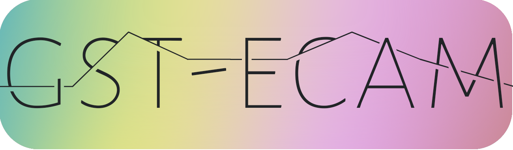

# [GST-ECAM-ROS](#gst-ecam)

<p>
 <div align="center">
 <a href="https://www.hs-kempten.de/ifm" target="_blank">
      </a>
  </p>
  <div>
    
    
    
  
    
  </div>
  </br>
</div>

This program captures video from a camera device using GStreamer, records it to an H264-encoded video file, and logs the video timestamps to a CSV file. The program is designed to work within the ROS (Robot Operating System) framework. For each video frame, the timestamp of the GStreamer buffer presentation (PTS) and the corresponding ROS time are saved. The camera is not published in ROS, which reduces the CPU load to a minimum.

The code is tailored to the [NileCAM25](https://www.e-consystems.com/de/camera-modules/ar0234-global-shutter-gmsl-camera-module-de.asp?srsltid=AfmBOopKlijtfN9erLg7-YVXAwC9klQPG91xswIzTiHnhOO1Llp5jukq) camera from e-con Systems on [NVIDIA ORIN AGX Development Kit 64 Gb](https://www.nvidia.com/de-de/autonomous-machines/embedded-systems/jetson-orin/). However, other cameras can be adapted easily by adapting the GStreamer pipeline. We tested Jetpack version 5.1.1.

This tool was developed in the context of the public-funded [HERMES-Project](https://www.hs-kempten.de/forschung/forschungsinstitute/ifm-institut-fuer-fahrerassistenz-und-vernetzte-mobilitaet/hermes). It is funded by the Bavarian Ministry of Economics Affairs, Regional Development and Energy. Grant number DIK0352/01

# [Table of contents](#table-of-contents)

- [GST-ECAM](#gst-ecam)
- [Table of contents](#table-of-contents)
- [Features](#features)
- [Dependencies](#dependencies)
- [Building the Program](#building)
- [Running the Program](#running)
- [ROS Parameter](#ros-param)
- [Code Overview](#code-overview)

  - [Main Components](#main-components)
  - [Key Functions](#key-functions)
  - [File Structure](#file-structure)
  - [Example Output](#example-output)
  - [Video decoding](#video-decoding)

- [License](#license)

---

## [Features](#features)

- **Video Capture**: Uses GStreamer to capture video from a camera device.
- **Timestamp Logging**: Logs the GStreamer buffer presentation (PTS) time and the corresponding ROS timestamps of video frames to a CSV file.
- **ROS Integration**: Periodically checks the status of the ROS node and gracefully handles shutdowns.
- **Configurable Parameters**: Camera device and recording path can be configured through ROS parameters.

## [Dependencies](#dependencies)

- ROS (Robot Operating System)
- GStreamer
- Boost (for date and time handling)

## [Building the Program](#building)

Ensure you have a ROS workspace set up. Then, follow these steps:

1. Clone the repository into your ROS workspace's `src` directory.
2. Navigate to the root of your workspace.
3. Build the package using `catkin_make` or `catkin build`.

```sh
cd ~/catkin_ws
catkin_make
```

## [Running the Program](#running)

After building, you can run the tool using ROS (assuming, your package is called _gst_ecam_):

`roslaunch gst_ecam single.launch`

The program will record `/dev/video0` and save the files according to the configuration in the launch file.

## [ROS Parameters](#ros-param)

**camera_device**: The device number of the camera (e.g., "0" for /dev/video0). Default is `"0"`.
**record_path**: The directory where the video and CSV files will be saved. Default is `"/storage/bag/"`.

You can set these parameters in the launch file or command line:

`rosrun your_package_name gst_ecam_node \_camera_device:=1 \_record_path:="/your/path/here/"`

## [Code Overview](#code-overview)

### [Main Components](#main-components)

**GStreamer Pipeline**: The GStreamer pipeline is constructed to capture video, encode it, and save it to a file. It also splits the stream to capture timestamps.

**Timestamp Logging**: Timestamps are captured for each frame and logged to a CSV file, with the ROS time and the elapsed time since the start of the program.

**ROS Integration**: The program uses ROS to manage the lifecycle of the node, including graceful shutdown when the ROS node is stopped.

### [Key Functions](#key-functions)

**get_timestamp_as_string**: Converts ROS time to a string in ISO 8601 format with an optional hour offset.

**new_sample**: Processes new video samples, logs timestamps, and handles GStreamer callbacks.

**flush_csv_buffer**: Periodically flushes the CSV buffer to ensure data is written to the file.

**check_ros**: Monitors the status of the ROS node and triggers shutdown if the node is no longer running.

### [File Structure](#file-structure)

**gst_ecam_node.cpp**: The main source file containing all the logic for video capture, timestamp logging, and ROS integration.

If you are starting multiple cameras (e.g. using `/launch/all.launch`), all files will have the device ID as postfix information.

### [Example Output](#example-output)

**Video File**: The video will be saved with a name based on the current timestamp and camera device.

Example:

- 2024-08-13T13-51-27-219219_0.h264

**CSV File**: Timestamps for each frame will be logged in a CSV file with two columns: GST PST time and ROS time.

Example:

- 2024-08-13T13-51-27-219219_0.txt

Content:

    1723549887778008040,1723549887609830088
    1723549887780036616,1723549887609888136
    1723549887803455016,1723549887609898216
    1723549887837533096,1723549887634066600
    1723549887871604712,1723549887668175496

Whereby the first column holds the PST, and the second column holds the ROS time.

<span style="color:red;">**Note**</span>: If GStreamer crashes, the program is automatically restarted for the corresponding device. In the event of a crash, both files are recreated with updated file names and content. If GStreamer crashes during startup, both files will be empty and zero size.

Example output in storage-directory:

- 2024-08-13T13-51-27-255719_0.h264 (**/dev/video0**)
- 2024-08-13T13-51-27-255719_0.txt (timestamp for **/dev/video0**)

- 2024-08-13T13-51-27-231306_1.h264 (**/dev/video1**)
- 2024-08-13T13-51-27-231306_1.txt (timestamp for **/dev/video1**)

- 2024-08-13T13-51-27-203772_2.h264 (**/dev/video2**)
- 2024-08-13T13-51-27-203772_2.txt (timestamp for **/dev/video2**)
- ...
- 2024-08-13T13-51-27-239817_5.h264 (**/dev/video5**)
- 2024-08-13T13-51-27-239817_5.txt (timestamp for **/dev/video5**)

## [Video decoding](#video-decoding)

The `input_video.h264` video file can be decoded to mp4 using ffmpeg:
`ffmpeg -i input_video.h264 output-video.mp4 `

# [License](#license)

MIT License

Copyright (c) 2024 IFM.adrive

Permission is hereby granted, free of charge, to any person obtaining a copy of this software and associated documentation files (the "Software"), to deal
in the Software without restriction, including without limitation the rights to use, copy, modify, merge, publish, distribute, sublicense, and/or sell
copies of the Software, and to permit persons to whom the Software is furnished to do so, subject to the following conditions:

The above copyright notice and this permission notice shall be included in all copies or substantial portions of the Software.

THE SOFTWARE IS PROVIDED "AS IS", WITHOUT WARRANTY OF ANY KIND, EXPRESS OR IMPLIED, INCLUDING BUT NOT LIMITED TO THE WARRANTIES OF MERCHANTABILITY,
FITNESS FOR A PARTICULAR PURPOSE AND NONINFRINGEMENT. IN NO EVENT SHALL THE AUTHORS OR COPYRIGHT HOLDERS BE LIABLE FOR ANY CLAIM, DAMAGES OR OTHER
LIABILITY, WHETHER IN AN ACTION OF CONTRACT, TORT OR OTHERWISE, ARISING FROM, OUT OF OR IN CONNECTION WITH THE SOFTWARE OR THE USE OR OTHER DEALINGS IN THE
SOFTWARE.


<p align=center>
</p>
